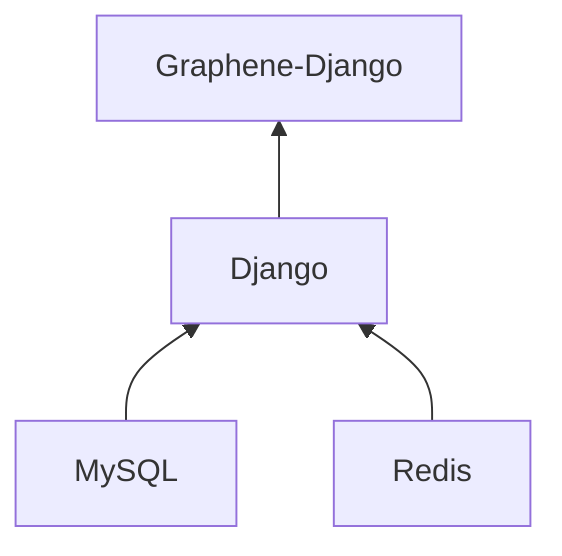

# 포트폴리오

Django + [Graphene-Django](https://docs.graphene-python.org/)를 이용한 쇼핑몰 포트풀리오입니다.

## 기술 스택

TODO: <https://mermaid-js.github.io/mermaid/#/flowchart?id=direction-in-subgraphs> 활용하여 그래프 변경

```mermaid
graph BT
    MySQL --> Django
    Redis --> Django
    Django --> Graphene-Django
```
